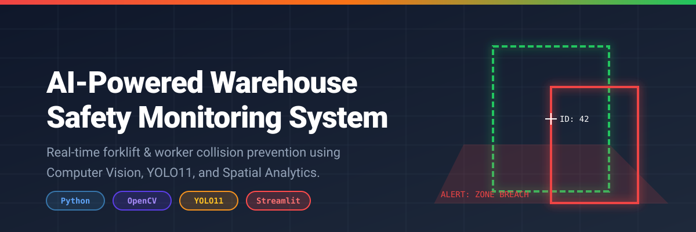
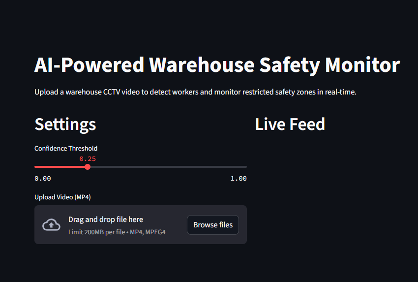
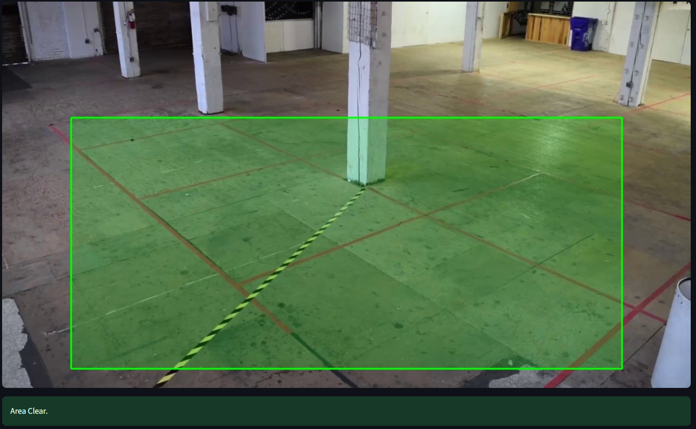
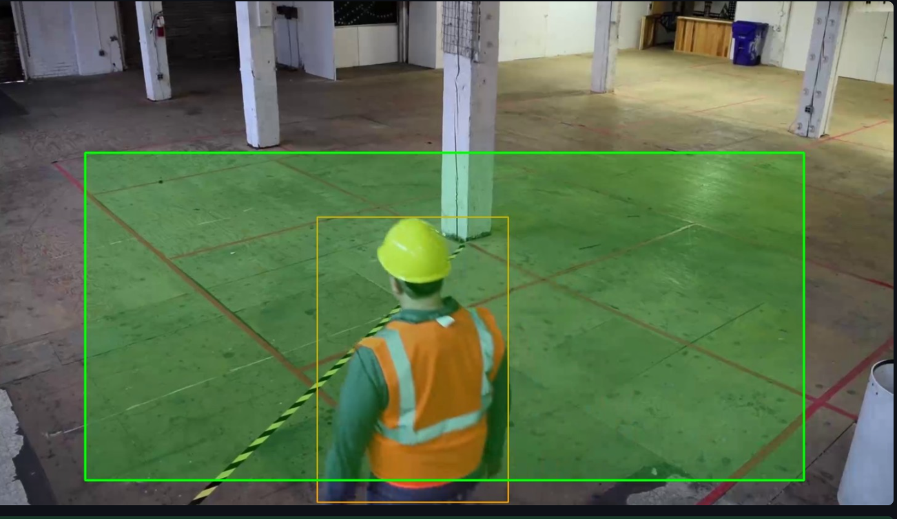
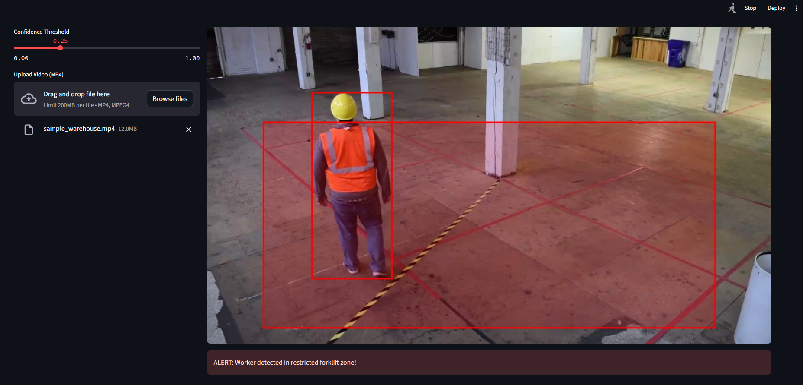
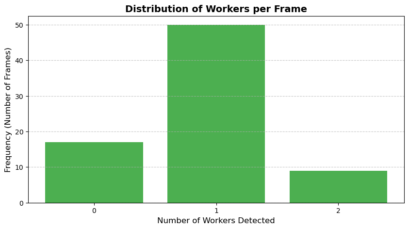

# 🏗️ AI-Powered Warehouse Forklift Safety Monitoring System

<p align="center">
  
</p>


An end-to-end **Computer Vision and Machine Learning** project that detects workers and machinery in real-time, tracks their movement, and generates dynamic alerts to prevent warehouse collisions.

Built with **Python**, **YOLO11**, **OpenCV**, **ByteTrack**, and **Streamlit**, this project demonstrates a complete MLOps lifecycle: from custom data collection and auto-annotation to model training, spatial mathematics (zone detection), and interactive web deployment.

---

## 📑 Table of Contents

- [🏗️ AI-Powered Warehouse Forklift Safety Monitoring System](#️-ai-powered-warehouse-forklift-safety-monitoring-system)
  - [📑 Table of Contents](#-table-of-contents)
  - [📌 Overview](#-overview)
  - [🖥️ Application Preview](#️-application-preview)
    - [Dynamic Zone Defense in Action](#dynamic-zone-defense-in-action)
  - [📂 Dataset \& Exploratory Data Analysis](#-dataset--exploratory-data-analysis)
  - [🛠️ Tech Stack](#️-tech-stack)
  - [🚀 Getting Started](#-getting-started)
    - [1. Clone the repository](#1-clone-the-repository)
    - [2. Install dependencies](#2-install-dependencies)
    - [3. Run the Streamlit Application](#3-run-the-streamlit-application)
    - [4. Test the System](#4-test-the-system)
  - [🧠 The ML Lifecycle: Active vs. Deferred Notebooks](#-the-ml-lifecycle-active-vs-deferred-notebooks)
    - [🟢 Active Pipeline (Executed)](#-active-pipeline-executed)
    - [🟡 Deferred for Future Iterations (Code Provided)](#-deferred-for-future-iterations-code-provided)
  - [📁 Project Structure](#-project-structure)
  - [📜 License](#-license)
  - [⭐ Support \& Citation](#-support--citation)

---

## 📌 Overview

Warehouses face significant safety hazards regarding the interaction between heavy machinery and pedestrian workers. Collisions result in severe injuries and operational downtime.

This project introduces a passive, AI-powered monitoring system that utilizes standard CCTV camera infrastructure to detect, track, and alert in real-time.

**The Pipeline:**
- 🎥 **Data Collection:** Custom frame extraction from warehouse footage.
- 🏷️ **Auto-Annotation:** Simulated automated labeling pipeline.
- 🤖 **Model Training:** Fine-tuning YOLO11 on custom worker data.
- 🎯 **Multi-Object Tracking:** Assigning persistent IDs to moving workers.
- 📐 **Spatial Logic:** Polygon-based danger zone breach detection.
- 🌐 **Deployment:** Interactive Streamlit web application.

---

## 🖥️ Application Preview

The project features a live Streamlit dashboard where users can upload warehouse footage, adjust AI confidence thresholds, and switch between robust base models and custom-trained engines on the fly.

<p align="center">
    
</p>

### Dynamic Zone Defense in Action

The core spatial logic utilizes OpenCV's `pointPolygonTest` to track the exact coordinates of a worker's feet. The system dynamically updates bounding box and zone colors based on spatial proximity to danger zones.

<table>
<tr>
<td align="center">
<b>🟢 Area Clear (Safe)</b><br>

</td>
<td align="center">
<b>🟠 Worker Detected (Approaching)</b><br>

</td>
<td align="center">
<b>🔴 Zone Breach (Alert Triggered)</b><br>

</td>
</tr>
</table>

---

## 📂 Dataset & Exploratory Data Analysis

Instead of relying on pre-packaged Kaggle datasets, this project utilizes a custom data ingestion pipeline. Frames were extracted at 1 FPS from public warehouse CCTV footage to prevent highly correlated image duplication.

Data was auto-annotated using a baseline model to simulate a manual labeling workflow, resulting in a dataset ready for fine-tuning.

<p align="center">
    
</p>

*EDA revealed a balanced distribution of workers per frame, ensuring the model learns to identify single and multiple subjects effectively.*

---

## 🛠️ Tech Stack

| Category | Technologies |
|-----------|--------------|
| **Language** | Python 3.10+ |
| **Computer Vision** | OpenCV, PIL |
| **Deep Learning** | PyTorch, Ultralytics YOLO11 |
| **Tracking Algorithm** | ByteTrack |
| **Web Application** | Streamlit |
| **Data Science** | Pandas, NumPy, Matplotlib |
| **Containerization** | Docker |

---

## 🚀 Getting Started

### 1. Clone the repository

```bash
git clone https://github.com/sanaurrehmanarain/forklift-safety-ai.git
cd forklift-safety-ai
```

### 2. Install dependencies

```bash
pip install -r requirements.txt
```

### 3. Run the Streamlit Application

```bash
streamlit run app/streamlit/app.py
```

### 4. Test the System

1. Open your browser to `http://localhost:8501`.
2. In the sidebar, under **Upload Video**, click **"Browse files"**.
3. Navigate to the `data/videos/` folder in this repository and select `sample_warehouse.mp4`.
4. Watch the AI process the video live, applying tracking IDs and triggering the Red Zone alert when the worker enters the restricted area!

> 💡 **Alternatively**, you can run the app via Docker using the included `Dockerfile` and `docker-compose.yml`.

---

## 🧠 The ML Lifecycle: Active vs. Deferred Notebooks

This repository contains a full suite of Jupyter Notebooks mapping the entire Machine Learning Lifecycle. To prioritize an Agile, "MVP-first" development approach, the notebooks are categorized into **Active Pipeline** and **Deferred Productionization**.

### 🟢 Active Pipeline (Executed)

| Notebook | Description |
|-----------|--------------|
| `01_data_collection.ipynb` | Video ingestion and frame extraction. |
| `02_annotation_analysis.ipynb` | Auto-annotation and EDA. |
| `03_data_analysis.ipynb` | Train/Val splitting and YAML configuration. |
| `04_training.ipynb` | YOLO11 model fine-tuning. |
| `06_tracking.ipynb` | ByteTrack integration. |
| `07_zone_detection.ipynb` | OpenCV polygon math and visual alerting. |

### 🟡 Deferred for Future Iterations (Code Provided)

The following notebooks are fully written and included in the repository but have been strategically deferred for future development phases:

- **`05_model_comparison.ipynb`** — Designed to benchmark YOLO11 vs RT-DETR vs Faster R-CNN. Deferred because testing heavy architectures requires cloud GPU compute, whereas the current focus is proving the end-to-end pipeline logic locally.
- **`08_evaluation.ipynb` & `09_error_analysis.ipynb`** — Deep statistical analytics (Confusion Matrices, F1 curves). Deferred because rigorous statistical evaluation requires a much larger dataset (10,000+ frames) to yield meaningful insights beyond our rapid-prototype dataset.
- **`10_model_optimization.ipynb`** — Exporting models to ONNX/OpenVINO with INT8 quantization. Deferred following the "Make it work, make it right, make it fast" methodology. Optimization is reserved for final edge-device deployment.
- **`11_development.ipynb`** — FastAPI backend creation. Deferred because Streamlit currently serves as an excellent, interactive full-stack alternative for the MVP.

---

## 📁 Project Structure

```
.
├── app/
│   └── streamlit/
│       └── app.py                 # Main dashboard application
├── assets/                        # Screenshots and charts for README
├── data/
│   ├── processed/                 # Train/Val split images and labels
│   ├── raw/                       # Raw extracted frames
│   ├── videos/                    # Source CCTV footage
│   └── dataset.yaml               # YOLO config file
├── notebooks/                     # Step-by-step ML lifecycle notebooks
├── outputs/                       # Annotated output videos
├── reports/                       # EDA charts and metrics
├── trained_models/                # Custom .pt model weights
├── Dockerfile                     # Containerization setup
├── requirements.txt               # Python dependencies
└── README.md
```

---

## 📜 License

This project is licensed under the MIT License. See the
[LICENSE](LICENSE) file for details.

---

## ⭐ Support & Citation

If you found this project useful, consider giving it a ⭐ Star on GitHub. It helps others discover the project and supports future improvements.

If you use this project in academic research, publications, educational
materials, or derivative works, please cite the project.

This repository includes a `CITATION.cff` file, so GitHub provides a
**"Cite this repository"** button in the repository sidebar. You can use it
to obtain citations in BibTeX, APA, and other supported formats.

**Suggested citation:**

Arain, S. U. R. (2026). forklift-safety-ai (Version 1.0) [Software].
<https://github.com/sanaurrehmanarain/forklift-safety-ai>

**Author:** Sana Ur Rehman Arain

**Profession:** Data Scientist

**GitHub:** <https://github.com/sanaurrehmanarain>

**Contact:** <sana.arain.work@gmail.com>

If you build upon this work, attribution is appreciated and helps others
discover the original project.

> **Note:** The MIT License requires that the original copyright
> notice be retained in copies of the Software.

---

© 2026 sana ur rehman arain.
